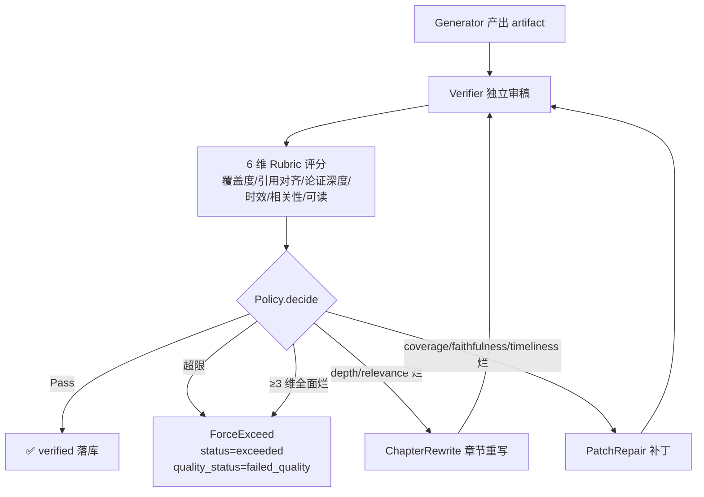

# Verifier Loop · Agent 自闭环质量保障 — 设计与面试

> 一份 Agent 产出靠不靠谱,不能由它自己说了算。Verifier Loop 给每份产出再加一道独立审稿——按 6 维 Rubric 评分,不达标自动选 Patch 或章节重写回炉,直到达标或超限。
> 对应能力域:**Agent 核心**(质量保障层)。代码:`api/app/core/agent/loop/`(controller/verifier/rubric/repair/policy/store/models)。

---

## 0. 能力定位(对应招聘要求)

- 对应 JD:**「Agent 工程化」「LLM-as-judge」「Loop Engineering」「Agent 自闭环」「质量评测」**。
- 角色:V0.0.5 主线第二大需求——把 Agent 从「跑得动」推到「跑得准」。是深度研究 / 定时任务的质量底座,也是把离线评测体系(① + ①.5)接进生产的桥梁。

---

## 1. 解决什么问题

- **痛点 1**:V0.0.5 之前 Agent 长任务链路(深度研究 v2 / 定时任务)**没人检查产出**——模型自己宣告完工,引用错位、章节遗漏、时效失真都没有兜底机制。
- **痛点 2**:① 离线评测发现的问题没接进生产。评测是「问题诊断器」,但发现问题后产线没有「修复机制」。
- **痛点 3**:在线 Research 与定时 Research 都需要一致的生产质量契约，不能为两个入口分别维护状态机。
- **方案**:落地 **Loop Engineering**(2026.6 Anthropic 提出的范式)——把 Agent 从「LLM 自循环」升级为「**外部系统驱动的循环 + 独立验证 + 智能修复 + 状态持久化**」。

---

## 2. 三个解耦(范式核心)

| 解耦原则 | 在 Comet 的实现 |
|---------|----------------|
| **Verify ⊥ Generate** | Verifier 使用不带 generator 历史的新 session；`same` 复用 generator 模型配置，`cross` 使用独立 verifier 配置。 |
| **Controller ⊥ Task** | `LoopController` 通用状态机,深度研究与定时任务复用相同质量契约。 |
| **State ⊥ Process** | DB(`loop_runs` + `loop_iterations`)保存运行与迭代审计记录；崩溃后 computation resume 留给 S4。 |

---

## 3. 架构 / 数据流



---

## 4. 核心设计与实现

### 4.1 6 维 Rubric(直接对齐 ① RAGAS)

| 维度 | 权重 | 评 0~5 | 单维硬门槛 | 对应离线指标 |
|------|-----|-------|-----------|------------|
| 覆盖度 coverage | 0.20 | 子问题覆盖完整度 | ≥3 | RAGAS context_recall |
| 引用对齐 faithfulness | 0.25 | Judge 对论断与 [来源N] 的对齐程度评分 | ≥3 | faithfulness Rubric |
| 论证深度 depth | 0.15 | 论证而非罗列 | ≥2 | (人工质量) |
| 时效性 timeliness | 0.15 | 关键事实是否最新 | ≥3 | 时间窗校验 |
| 相关性 relevance | 0.15 | 切题不跑偏 | ≥3 | RAGAS answer_relevancy |
| 可读 readability | 0.10 | 结构与表达 | ≥2 | (人工质量) |

加权总分 ≥ 0.70 + 全部维度过硬门槛 = 通过。

S3a 只建立 `faithfulness` / 引用对齐这一评分维度及严格 Judge 输出契约；完整 evidence 正文、稳定证据标识和 claim-support 判断留给 S3b。

### 4.2 双 Verifier 实现

| 实现 | 用途 | 配置 |
|------|------|------|
| `SameModelVerifier` | 基线 | 同 chat 模型重新起一个 messages 数组(不带 generator 历史),用 `critic_role.jinja2` 强调独立审稿人立场 |
| `CrossModelVerifier` | 独立配置审稿 | 使用 `model_configs.type='verifier'` 的默认配置,走 chat/completions 端点；`cross` 不代表已验证模型 family |

**工厂语义**:`build_verifier(kind='cross')` 遇到配置缺失、查询失败或模型构建失败时抛出 `VerifierUnavailableError`；`LoopController` 捕获后记录 `quality_status=unavailable`，不伪装成正常的 same 审稿结果。配置项 `loop_verifier_kind` 默认值为 `cross`。

### 4.3 智能 Repair 策略(Policy 决策树)

不是「不通过就重做」,而是按问题类型自动选最经济的修复:

```python
# 优先级从高到低
Pass                                  # 总分 ≥ 0.70 + 全部硬门槛过
ForceExceed                           # 超过 max_iterations 或 ≥3 维全面烂
ChapterRewrite                        # depth / relevance 落地 → 章节重写
PatchRepair                           # coverage / faithfulness / timeliness 落地 → 补丁
PatchRepair (兜底)                    # 其他情况
```

| 策略 | 实现 | 何时用 |
|------|------|------|
| `PatchRepair` | 贪心补丁——从 `feedback.missing_coverage` / `wrong_citations` / `issues` 抽子查询(去重截断到 3 条),通过 `ctx["patch_callback"]` 解耦于 research engine,engine 用 reflector 风格补搜+提炼,产出「补充信息(质量复核反馈后追加)」章节追加到 artifact | coverage / faithfulness / timeliness 不达标 |
| `ChapterRewrite` | 章节重写——与 `artifact.headings` **求交集防 verifier 编造章节名**,最多 2 章/轮,通过 `ctx["rewrite_callback"]` 解耦,engine 调 `write_section_stream` 重写并替换 | depth / relevance 不达标 |
| `ForceExceed` | 沿用最后一次 artifact 兜底返回；legacy `status=exceeded`，`quality_status=failed_quality` | 超限或全面烂 |

不同问题类型走不同修复路径；默认 `max_iterations=2` 只表示有界停止策略，不代表已验证的修复成功率。

### 4.4 状态外置(`loop_runs` + `loop_iterations`)

两张表(Alembic 迁移 `7a3c4d5e6f01`):

- `loop_runs(id, task_type, task_id, status, quality_status, iterations, final_score, verifier_kind, started_at, finished_at, ...)`
- `loop_iterations(id, run_id, iteration_no, scores JSONB, feedback JSONB, decision, repair_action, artifact_snapshot JSONB, ...)`

**每轮实际 verify 结果写入 `loop_iterations`**,artifact 摘要 JSONB 落库，供审计与后续 S4 恢复能力使用；当前不支持从中断点恢复 computation。

### 4.5 通用 LoopController(抽象成立的证据)

```python
class LoopController:
    async def run(self, *, task_type, task_id, max_iterations, ctx):
        # 1. generator 产出初版 artifact
        # 2. verifier 评分；cross 不可用时显式 unavailable
        # 3. policy.decide → Pass / Exceed / Patch / Rewrite
        # 4. 走 repair_callback → 回到 2
        # 5. 落库 + IterationOutcome.id 预生成 UUID(与 trace span iteration_id 共用)
```

生产接入的架构价值在于职责边界，而不是代码行数：`LoopController` 不依赖 Research 实现；Research 通过 `patch_callback` / `rewrite_callback` 注入具体 repair。在线 Research 与定时 Research 复用同一 Research engine 和 Loop 状态机，定时推送再通过 `_check_loop_passed(report_id)` 读取质量门禁结果。HotpotQA `qa_verifier` 是独立离线评测路径，不复用生产 `LoopController` 或其状态契约。

---

## 5. 可观测性(Loop 健康度卡)

`DashboardService.loop_health(days=30)` 聚合 `loop_runs` + `loop_iterations.scores.raw` 扫单维不达硬门槛次数,前端 `LoopHealthCard`:
- 4 宫 KPI:五态记录 / 一次通过率 / 平均迭代次数 / 平均评分；通过率和均值只以合法 judged runs 为分母
- 质量状态分布:`passed / failed_quality / judge_error / unavailable / skipped`；历史 `quality_status=NULL` 作为 unknown 排除在五态统计外
- 失败维度归因 Top(哪一维最容易翻车)
- verifier_kinds 分布只统计实际运行 Judge 的 same / cross

HomePage 在 Agent 简报后渲染(无数据时不显示)。

前端分别展示通过、质量未通过、审稿异常、不可用、已跳过；历史 nullable unknown 显示为质量状态未知或质量未确认。

---

## 6. 设计取舍

| 取舍 | 选择 | 原因 |
|------|-----|------|
| 用 LangChain Evaluators? | 不用 | 字段太重、与项目 Rubric 不齐;自己实现 Rubric + LLM-as-judge 更轻 |
| same vs cross? | 按配置选择 | same 使用 generator 模型的新 session；cross 使用独立 verifier 配置，不推断 family |
| 普通对话过 verifier? | 不过 | token 翻倍但用户感知不到,负收益 |
| 失败硬阻断? | 不阻断 | 沿用最后一次 artifact 兜底,业务零阻断,失败信息走通知 |
| 每个产出都重做? | 不重做 | 智能 Repair 决策树按问题类型选 Patch / Rewrite / Exceed |

---

## 7. 易踩坑

- **Verifier 编造章节名**:让 verifier 指 weak_chapters 时,大模型偶尔编造 artifact 里没有的章节名。修法:`ChapterRewrite` 与 `artifact.headings` **求交集**,只重写真实存在的。
- **iteration_id 关联**:`IterationOutcome.id` 必须**预生成 UUID** 与 `LoopStore.record_iteration` 共用,这样 ③ Tracing 的 span iteration_id 才能精确绑定到对应迭代轮次。后改困难,设计时就要确定。
- **生成器上下文污染 verifier**:Verifier 必须新开 messages 数组,不能 append 到 generator 的 messages 后面——否则 verifier 倾向于「认同自己刚写的」。
- **失败硬阻断**:任何阶段异常 → 沿用最后一次 artifact 兜底返回,业务零阻断。verifier 模型挂了不能影响主流程。
- **Cross verifier 不可用**:缺配置、配置查询失败或模型构建失败时记录 `unavailable`,报告仍继续交付。

---

## 8. 面试讲点(每条对应真决策 + 真数据)

1. **解耦 Verify 与 Generate**:Verifier 不携带 generator 历史；same 与 cross 明确区分模型配置来源。
2. **解耦 Controller 与 Task**:深度研究与定时任务共享同一状态、评分和失败语义。
3. **状态外置**:`loop_runs` + `loop_iterations` 两表保留 audit trail，并为后续 S4 恢复能力提供基础。
4. **智能 Repair 决策树**:不是「不通过就重做」,是按问题类型选 Patch / Rewrite / Exceed,工程取舍。
5. **Rubric 边界**:S3a 包含 faithfulness / 引用对齐评分维度；完整 evidence 与 claim-support 校验属于 S3b。
6. **显式不可用语义**:独立 verifier 配置不可用时不静默降级，也不生成虚假质量分。
7. **明确边界**:不做普通对话 verifier、不做实时流式 verifier、不做用户配 Rubric——知道哪些不该做。

---

## 9. 简历话术(可直接用)

> **Verifier Loop 自闭环质量保障**:实现 Generate→Verify→Repair 三段式 Loop——Verifier 按 6 维 Rubric 严格评分，智能 Repair 策略(Patch/章节重写)按问题类型选择；深度研究与定时任务共享质量状态契约。运行与迭代记录落库用于审计，并为后续 S4 恢复能力提供基础。

---

## 10. 相关文件速查

| 类别 | 路径 |
|------|------|
| Controller | `api/app/core/agent/loop/controller.py` |
| Verifier | `api/app/core/agent/loop/verifier/llm_verifier.py` + `base.py` |
| Rubric | `api/app/core/agent/loop/rubric/__init__.py`(RUBRICS dict) |
| Repair | `api/app/core/agent/loop/repair/patch_repair.py` + `chapter_rewrite.py` |
| Policy | `api/app/core/agent/loop/policy.py`(决策树) |
| Store | `api/app/core/agent/loop/store.py`(`LoopStore`) |
| 模型 | `api/app/core/agent/loop/models.py` + `api/app/models/loop_model.py` |
| 迁移 | `api/migrations/versions/7a3c4d5e6f01_*.py` + `a14c9f0e3b21_*.py` |
| Prompt | `api/app/core/agent/loop/verifier/prompts/` |
| 接入点 | `api/app/core/agent/research/engine.py` + `api/app/tasks/agent_task.py:_check_loop_passed` |
| 仪表盘 | `api/app/services/dashboard_service.py` + `web/src/components/research/LoopHealthCard.tsx` |
